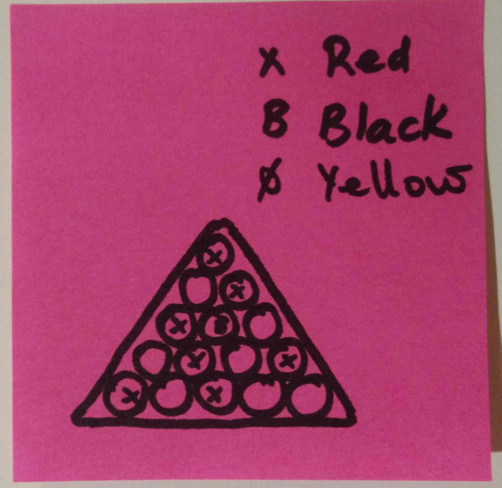
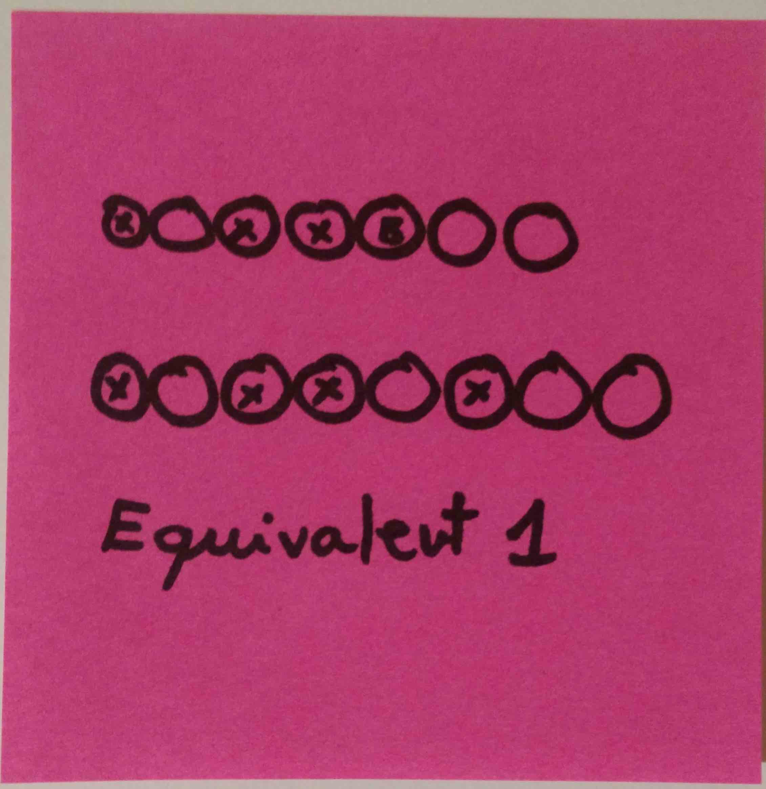
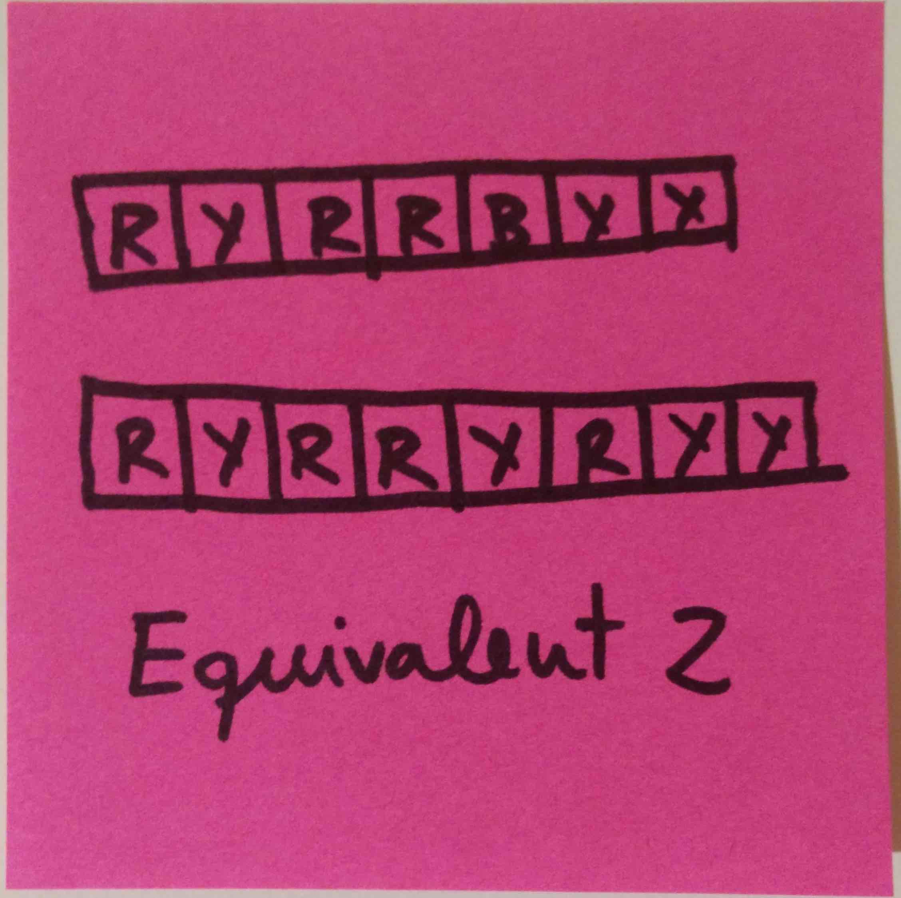
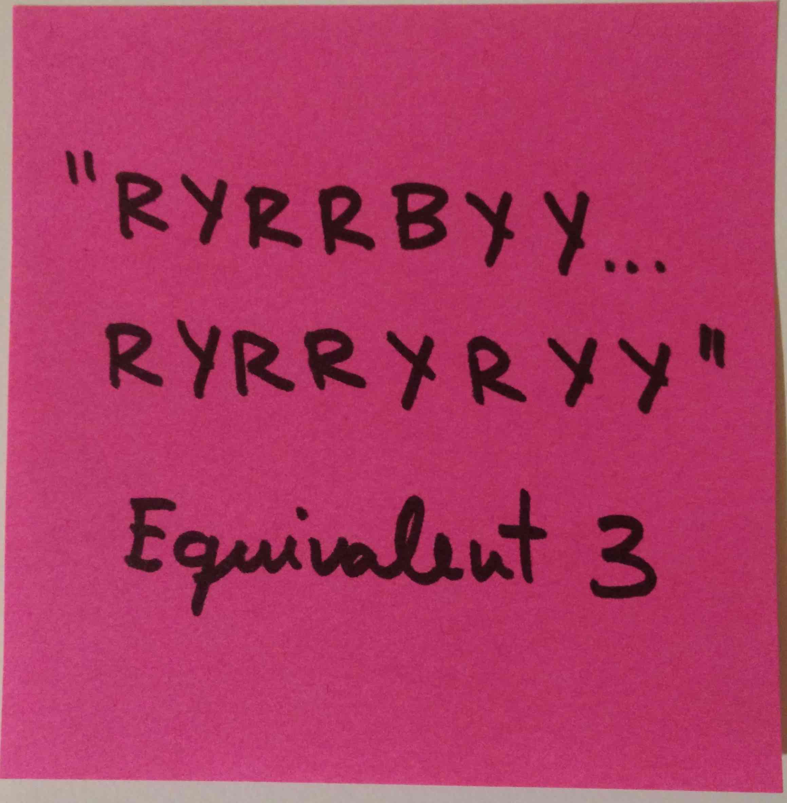

# Pool Balls kata formulation

## Description

The pool ballks must be distributed in a very specific fashion, according to the rules.

The balls end up inside the triangle in a random order (depending on the previous match).

### A note about the problem domain

A triangle of pool balls is equivalent to an array of ball representations




In this case, a `String` is enough to represent it.

The valid format is:

  * Y for Yellow
  * B for Black
  * R for Red
  
## Input and output

Expected format:

```
amount:$AMOUNT
swap:$FROM,$TO
swap:$FROM,$TO
```

  * Given that the swap operation satisfies this property: `swap:X,Y` == `swap:Y,X`, we'll write the smaller number first. Implies: `X <= Y`
  * Given that the swap with itself (`swap:X,X`) is not a valid operation, implies: `X != Y`
  * Corollary: For every swap between X and Y, `X < Y`

Example:

```
amount:2
swap:1,2
swap:1,8
```
  
## Problems

### Problem 1

Calculate **the minimum number** of necessary ball swaps from the initial state to the corect one

### Problem 2

Calculate **which ball swaps** are the minimum necessary set to arrange the balls. 

Suggestion: solve problem 1 first

### Problem 3 (:star:)

Calculate **which ball swaps** are the longest path from the initial state to the correct one, without repeating intermediate states (I.e., there are not loops in the states)

Example:
  
  * Assume `YRY` is the correct state
  * Assume `RYY` is the initial state
  
The solution is:
```
amount:2
swap:0,2
swap:1,2
```

Explanation:

  * From the initial state, `swap:0,1` (`RYY` -> `YRY`) solves the problem
  * From the initial state, `swap:1,2` (`RYY` -> `RYY`) is a forbidden swap because it is idempotent (i.e., introduces no change in the state)
  * From the initial state, `swap:0,2` (`RYY` -> `YYR`)
     * `swap:0,2` (`YYR` -> `RYY`) is forbidden for repeating state (introduces a loop)
     * `swap:1,2` (`YYR` -> `YRY`) solves the problem
 
Given that there are two solutions (`amount:1` and `amount:2`), we prefer the one with the biggest `amount`
